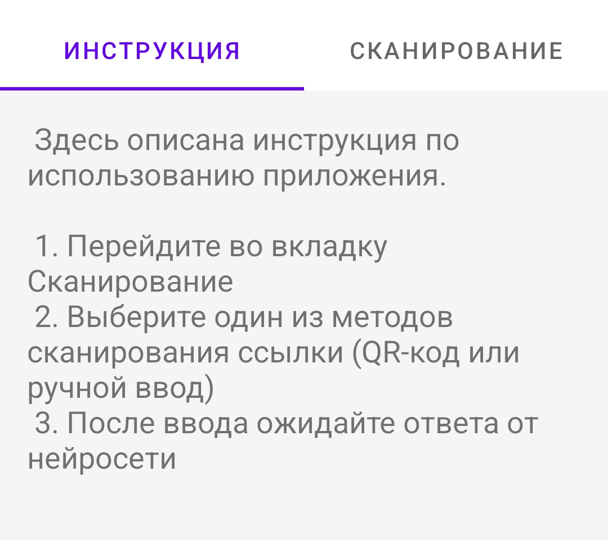
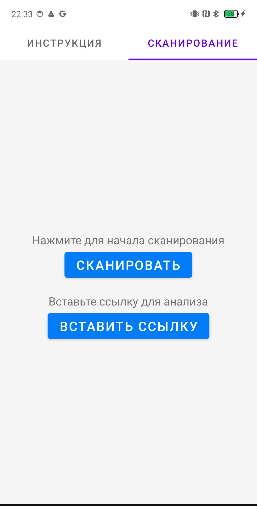
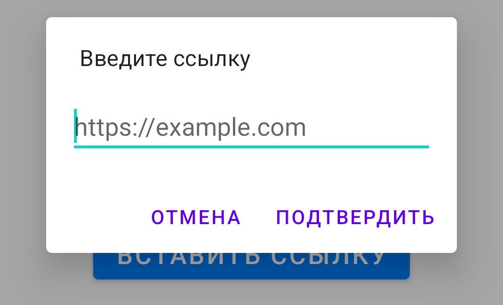
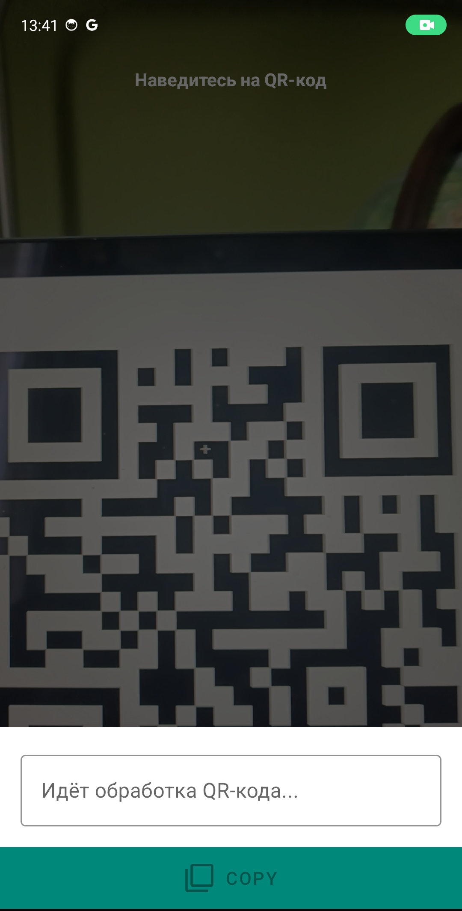

# Документация приложения QR Neuro-Analyzer для пользователя

## 1. Введение
Приложение QR Neuro-Analyzer позволяет сканировать QR-коды, вводить ссылки вручную и отправлять их на обработку нейросети, для анализа потенциальных уязвимостей которые могут содержаться в переданном QR-коде или ссылке.

Основные функции:

 - 📷 Сканирование QR-кодов через камеру.

 - ✏️ Ручной ввод ссылки.

 - 🤖 Отправка ссылки нейросети для анализа.

После анализа вы получите отчёт о том, насколько безопасна ссылка и стоит ли по ней переходить и, возможно, оставлять свои данные!

## 2. Установка и запуск
### 2.1. Установка

1. Установите qr-neuro-analyzer.apk из репозитория и запустите на своём устройстве. В будующем оно будет опубликовано в Google Play.
2. Дайте необходимые разрешения на использование камеры, интернета и принятие пользовательского соглашения. Без них приложение работать не будет!

### 2.2. Первый запуск
Приложение запросит разрешения:

 - Доступ к камере – для сканирования QR-кодов.

 - Доступ к фонарику – для подсветки (по желанию).

 - Доступ к интернету - для запросов к нейросети

 - Принятие пользовательского соглашения - для доступа к приложению.

***Если разрешения не даны, приложение не сможет выполнять свои основные функции***

## 3. Как пользоваться приложением

### 3.1. Инструкция

Инструкция нужна для более быстрого удобного пользования приложением. Там кратко описывается как человек может просканировать ссылку или QR-код, без просмотра отдельно документации.

### 3.2. Сканирование QR-кода

 - Откройте приложение.

 - Нажмите на вкладку "Сканирование" на панели сверху.

 - Нажмите на кнопку "Сканировать" по середине экрана.
 
 - Наведите камеру на QR-код.

 - Если освещение плохое, нажмите на иконка молнии.

После этого программа автоматически распознает QR-код, передаст необходимую информаци нейросети и выдаст вам отчёт!

### 3.3. Ручной ввод ссылки

 - Нажмите кнопку "Ввести ссылку".

 - Нажмите на вкладку "Сканирование" на панели сверху.

 - Нажмите на кнопку "Ввести ссылку" по середине экрана.

 - Введите URL в текстовое поле.

 - Нажмите "Отправить" – ссылка будет обработана нейросетью.

### 3.4. Просмотр результата
После обработки нейросетью вы увидите отчёт в формате:

**Цепочка редиректов: {Последовательность перехода по URL адрессам}**

**{Сам отчёт с описанием потенциальных угроз конфиденциальности различных данных пользователя и рекомендации по взаимодействию с этой ссылкой}**

**Оценка {X}/10**

Оценка варьируется от 1 до 10, где 10 - абсолютно безопасная, а 1 - абсолютно небезопасная.

Дополнительно пользователь может скопировать результат обработки в буфет обмена.

***После просмотра, с помощью движения пальца от края экрана в сторону окно с ответом нейросети закрывается***

# 4. Возможные проблемы и решения
## QR-код не сканируется	
Проверьте освещение, очистите камеру, попробуйте другой угол. Убедитесь, что QR-код вообще возможно считать 
## Ссылка не обрабатывается	
Убедитесь, что URL введен правильно (как в примере в поле ввода) и есть интернет.
## Приложение вылетает	
Перезапустите его или переустановите. В крайнем случае напишите об ошибке разработчику на email с описанием ваших действий

# 5. Часто задаваемые вопросы (FAQ)
## ❓ Нужен ли интернет для работы?
Да, нейросеть обрабатывает ссылки онлайн.

## ❓ Сохраняет ли приложение историю запросов?
Нет, только передаёт содержимое каждого запроса нейросети

## ❓ Можно ли использовать приложение без камеры?
Да, но оно будет работать только для ручного ввода ссылок.

## ❓ Какие технологии используются в решении?
 - CameraX - для использования камеры телефона для считывания QR-кода
 - ZXing - для получения содержимого QR-кода
 - Gigachat - для анализа ссылок
 - Kotlin - язык программирования на котором написано приложение
 - Программные пакеты Android - для реализации мобильного приложения на ОС Android

# 6. Контактная информация
Email: qrneuroanalyzer@yandex.ru
